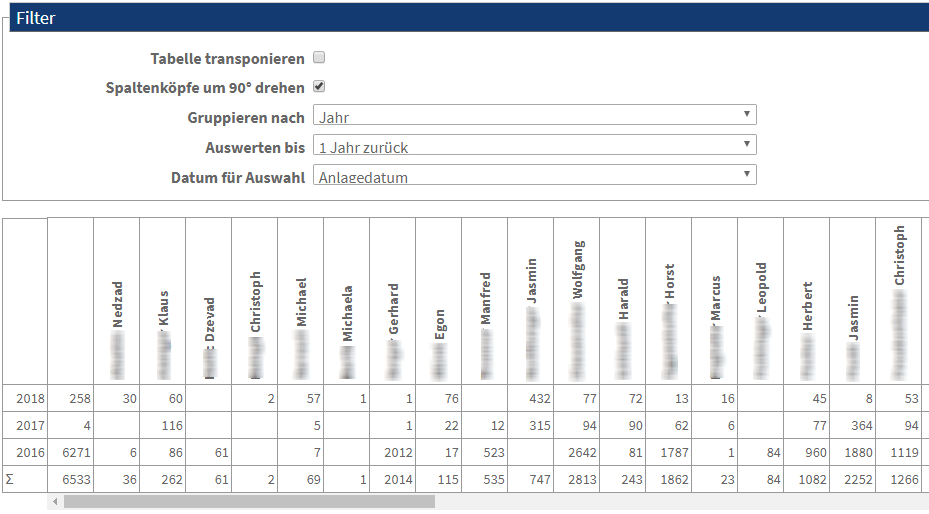

.. ==================================================
.. FOR YOUR INFORMATION
.. --------------------------------------------------
.. -*- coding: utf-8 -*- with BOM.

.. include:: ../Includes.txt

.. _user-manual:

Benutzeranleitung
=================

Zielgruppe: **Frontend-Benutzer**

Wenn die Erweiterung installiert wurde und Sie über die korrekten Zugriffsberechtigungen verfügen, 
dann zeigt die Erweiterung ungefähr folgendes (oder ein ähnlichse Bild:

   Beispiel für Kreuztabelle

In der Regel können Sie folgende EInstellungen über das Frontend vornehmen:

- Tabelle transponieren
- Spaltenköpfe um 90° drehen
- Gruppieren nach
- Auswerten bis
- ...

Die ersten beiden Punkte werden vom System bereitgestellt und sind selbsterklärend.

Die weietren Parameter werden durch den Administrator bzw. den Programmierer konfiguriert und vorgegeben und richten sich
nach dem jeweiligen Anwendungsbereich.